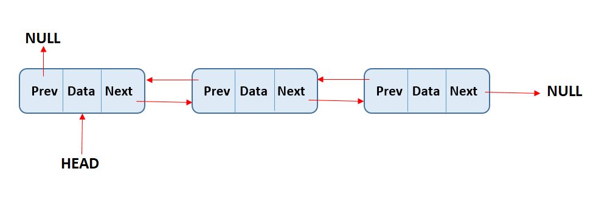

# 연결 자료구조 방식(= 비순차 자료구조 방식) : Linked List
    ✍️ 연결자료 방식은 물리주소가 아닌 각 원소에 저장되어 있는 다음 원소의 주소에 대한 참조에 의해서 연결되는 방식 

## 1. 장점
- 논리적인 순서와 물리적이 순서를 일치시키기 위한 오버헤드가 발생하지 않는다.
- 순차자료구조는 배열을 사용하기 때문에, 고정크기 메모리 공간을 사용한다. 하지만, 연결 자료구조에서는 여러개의 작은 공간을 연결하여 전체를 표현하기 때문에 크기 변경이 유연하고 좀 더 효울적으로 메모리를 사용할 수 있다.
- link field의 reference값에 대한 연산만으로 쉽게 삽입/삭제 연산을 수행할 수 있다.

`` ``

    👉 순차 자료구조 방식에서의 연산시간에 대한 문제와 저장공간에 대한 문제를 개선한 자료구조 표현방식

## 2. Node
연결 자료구조 방식에서 원소는 연결될 다음 원소 원소에 대한 주소를 저장해야하기 때문에 <원소,주소>의 단위로 저장해야 한다. 이러한 단위구조를 노드(node)라고 한다.

data field : 저장할 원소의 형태에 따라서 하나 이상의 필드로 구성하기도 한다.  
link field : 메모리 참조 변수를 사용하여 다음노드의 주소에 대한 참조값을 저장하며, 링크 또는 참조(reference)라고 한다.  


   

<small>출처 : <cite>https://www.programiz.com/dsa/linked-list</cite> </small>

## 3. 연결 자료구조 방식 종류

### 3.1 Singly Linked List   
Node에 link field가 한 개 밖에 없는 연결리스트를 단순 연결 리스트(Singly Linked List) 혹은 선형 연결 리스트(Linear Linked List) 혹은 연결 리스트라고 한다.  
그러나, 한 방향으로만 순회하는 구조이기 때문에, 이전 노드를 접근할려면 첫 번째 노드에서 다시 시작해야 한다.

- 삽입 연산 : 이전 Node의 link field에 삽입할 Node를 참조하고, 삽입할 Node의 link field에는 다음 Node를 참조값으로 저장한다. 
-  삭제 연산 : 이전 Node의 link field에 삭제할 Node의 다음 Node로 덮어씌운다. 여기에 삭제된 Node의 link field를 굳이 null 처리할 필요는 없다.(가비지 컬렉션이 처리?)

<details>
<summary>단순 연결 리스트 알고리즘</summary>

```java
class Node{
    private String data;
    public Node link;
    public Node(){
        this.data = null;
        this.link = null;
    }

    public Node(String data){
        this.data = data;
        this.link = null;
    }

    public Node(String data, Node link){
        this.data = data;
        this.link = link;
    }

    public String getData(){
        return this.data;
    }
}

class LinkedList{
    private Node head;
    public LinkedList(){
        head = null;
    }
    
    //insert 연산
    public void insertMiddleNode(Node pre, String data){ 
        if (pre == null) return;
        Node node = new Node(data);
        node.link = pre.link;
        pre.link = node;
    }
    public void insertLastNode(String data){
        Node node = new Node(data);
        if (head == null){
            this.head = node;
        }else{
            Node temp = head; // 임시 참조 변수에 주소를 참조
            while (temp.link != null) temp = temp.link; // node 순회
            temp.link = node;
        }
    }
    
    //delete 연산
    public void deleteLastNode(){
        Node pre, temp;
        if (head == null) return;
        if (head.link == null){
            head = null;
        }else{
            pre = head;
            temp = head.link;
            while (temp.link != null){
                pre = temp;
                temp = temp.link;
            }
            pre.link = null;
        }
    }

    //Search
    public Node searchNode(String data){
        if (head ==null) return null;
        Node temp = head.link;
        while (temp != null){
            if (temp.getData() == data) return temp;
            temp = temp.link;
        }
        return null;
    }

    public void printList(){
        if (head == null) return;
        Node temp = head;
        while (temp != null){
            System.out.print(temp.getData());
            temp = temp.link;
        }
        System.out.println();
    }
    
}
```
</details>
<br>

### 3.2 Circular Linked List  
마지막 노드가 첫번째 노드를 가리키게 하여 원형으로 만든 연결리스트를 원형 연결 리스트라고 한다. 원형으로 계속 순회하기 때문에 link를 따라 계속 순회하면, 이전 노드에 접근할 수 있다.  
그러나, 이전 노드에 접근하기 위해서는 한 바퀴를 순회 해야하는 문제가 있다. 이는 link가 한방향으로만 되어 있기어서 반대방향으로 순회할 수 없기 때문에 발생한다.

- 삽입 연산 : 마지막 노드의 link field는 NULL이 아닌 첫번째 노드를 참조하도록 하는 점을 제외하고는 연결 리스트 경우와 같다.
- 삭제 연산 : 마지막 혹은 첫번째 노드 삭제시 중간 노드와 마찬가지로 link field를 변경해야 하는 경우를 제외하고는 연결리스트 경우와 같다.

### 3.3 이중 (원형)연결 리스트   
양방향으로 순회할 수 있도록 link field가 2개 인 리스트를 이중 연결 리스트라고 한다.  
이중 연결리스트의 node는 [ 링크필드(llink/left filed) ][ 데이터필드 ][ 링크핑드(rlink/right filed  ) ] 두 개의 링크 필드와 한개의 데이터 필드로 구성된다. 

   

<small>출처 : <cite>https://www.alphacodingskills.com/ds/doubly-linked-list.php</cite> </small>

양쪽의 link field는 양쪽 노드를 참조하고 있기 때문에 양 방향으로 순회가 가능하다. 이때 첫번째 노드와 마지막 노드가 연결되어 있다면, 이중 원형 연결 리스트라고 한다.
- 삽입/삭제 연산 : (원형) 연결리스트와 같은 방법으로 진행되지만, 양쪽방향으로 모두 진행된다는것이 다른 점이다. 

## 4. Free Space List
연결 리스트에서 삽입 연산을 할려면, 먼저 메모리에서 공백 노드를 가져와야하고, 삭제 연산에서는 삭제되어 사용하지 않는 노드에 대한 메모리공간을 처리해야 한다. 즉, 삽입/삭제 연산에는 메모리공간 할당 작업이 필요하다.<br><br>
이러한 작업을 일일이 처리하는 대신에 사용하지 않는 메모리 공간이 미리 노드의 구조로 나뉘어져 연결리스트로 만들어져 노드를 할당하거나 혹은 반환할 수 있다면, 연산과정과 메모리 관리가 효율적으로 이루어질 수 있다.

    ❗ 메모리를 사용하기 전에 미리 노드를 나누어서 연결해 놓은 리스트를 자유 공간 리스트라고 한다.
<br>

---

## Reference

- 자바로 배우는 자료구조 방식