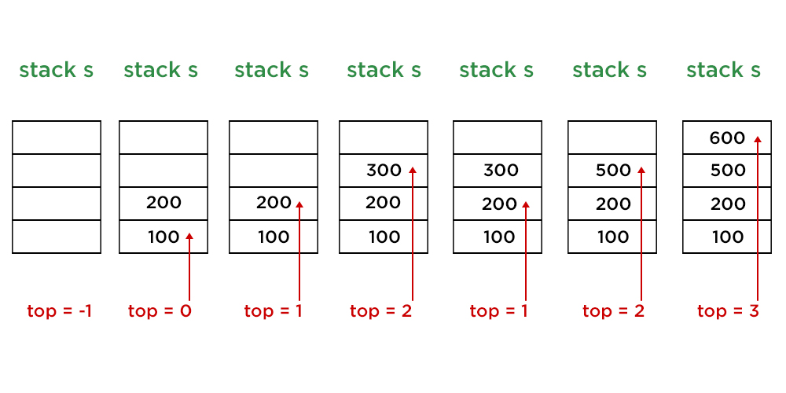

# Stack  
    ✍️ Stack 자료구조는 접시를 쌓듯이 자료를 쌓아 올린 형태의 구조를 말한다.

## 1. Stack이란?
Stack은 top으로 정한 한 곳에서만 쌓을 수 있고, 접근하도록 제한하여 만든 자료구조이다. 
top으로만 접근이 가능하기 때문에 나중에 들어온 자료가 맨 위에 위치하게 되고, 삭제하는 자료도 가장 위에 위치하는 자료이다.(삽입연산을 push, 삭제 연산을 pop이라고 한다.)  
따라서, 스택은 시간순서에 따라 자료가 쌓이고, 삭제 할때믄 가장 마지막에 삽입된 자료가 가장 먼저 삭제되는 **후입선출**(LIFO, Last-In-First-Out)의 구조를 가진다. 

## 2. 순차 자료구조 방식을 이용한 Stack의 구현

순차 자료구조인 1차원 배열을 이용하여 스택을 구현할 수 있다. 스택에 원소가 쌓이는 순서는 배열의 인덱스(index)로 표현한다. 따라서 스택의 첫번째 원소는 stack[0]에 저장하고, i번째 원소는 stack[i-1]에 저장한다. 배열 stack의 마지막 원소의 인덱스 값을 변수 top에 저장한다. 스택이 초기 상태(공백)일 때 top은 -1을 저장한다. 

   

<small>출처 : <cite>https://www.geeksforgeeks.org/how-to-implement-stack-in-java-using-array-and-generics/</cite> </small>

<details>
<summary>순차 자료구조 방식을 이용한 Stack 알고리즘</summary>

```java
```
</details>
<br>

## 3. 연결 자료구조 방식을 이용한 Stack의 구현

순차 자료구조를 이용한 스택은 배열을 사용하여 구현하기는 쉽지만, 물리적으로 크기가 고정된 배열을 사용하기 때문에 스택의 크기를 변경하기가 어렵고, 메모리의 낭비가 생길 수 있다는 문제가 있다. 이러한 순차 자료구조 방식의 문제는 연결 자료구조 방식을 이용함으로써 해결할 수 있다.  

연결 자료구조 방식의 단순 연결 리스트를 이용하여 스택을 구현하면, 스택의 원소는 연결리스트의 노드가 된다. 스택에 원소를 삽입할 때마다 연결 리스트에 노드를 하나씩 연결한다. 그리고 스택원소들간의 순서는 연결리스트 노드의 링크를 사용하여 표현한다. 스택의 top을 표현하기 위해서 참조 변수 top(리스트 이름?)을 사용한다.  스택이 초기 상태일 경우 top은 null이지만, 삽입할때마다 참조변수의 값이 새로 저장한 노드의 참조값으로 저장하게 된다. 즉, 연결 자료구조 방식은 첫번째 노드에 계쏙 삽입이 되어서 참조변수의 값이 계속 바뀌는 구조이다.

PUSH 일 경우 순차와 마찬가지로 TOP에 마지막원소의 참조값이 저장된다. 즉, PUSH를 할 경우 뒤에 연결되는 것이 아니라 앞에 연결이 된다. POP 삭제 또한 앞에서부터 삭제가 되고, OP 참조값이 변경이 된다. 이렇나 과정은 후입선출 구조 임을 알 수 있다.후입(앞에서 PUSH)선출(앞에서 POP), 즉 이때의 TOP은 순차와는 달리 첫번째 위치임을 의미함을 알 수 있다.?

<details>
<summary>연결 자료구조 방식을 이용한 Stack 알고리즘</summary>

```java
```
</details>
<br>

---

## Reference

- 자바로 배우는 자료구조 방식