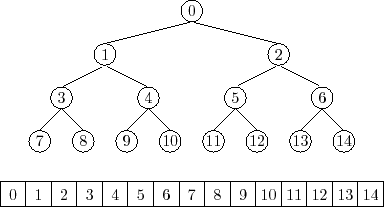

# Binary Tree
    ✍️ 모든 Node의 차수를 2 이하가 되도록 만든 Tree가 이진 트리이다.
## 1. 이진트리의 특징
- 이진 트리는 공백노드도 이진 트리의 노드로 취급한다. (자식이 없는 단말 노드도 공백노드를 자식으로 가진 이진트리이다.)
- n개의 노드를 가진 이진 트리는 항상 (n-1)개의 간선을 가진다.
- 높이가 h인 이진트리가 가질 수 있는 노드의 최소 갯수는 (h+1)개, 최대 갯수는 (2<sup><small>(h+1)</small></sup> -1 )개 이다.

## 2. 이진트리의 분류
- Full Binary Tree : 모든 Node가 Child를 0개 혹은 2개를 가진 Tree를 포화 이진트리라고 한다. 높이가 h일때, 노드는 항상 최대 갯수인 ( 2<sup><small>(h+1)</small></sup> -1 )개를 가진다.
- Complete Binary Tree : 왼쪽부터 Node가 채워져 있는 Tree를 완전 이진 트리라고 한다.
- Pervect Binary Tree : 모든 Node가 무조건 Child를 2개만 가지고 있고, Leaf의 Level이 모두 일치하는 Tree이다. N개의 Leaf을 가지고 있으면, Node의 수는 2<sup><small>n</small></sup> - 1개를 가진다.
- Skewed Binary Tree : 이진 트리중에서 최소 갯수의 노드를 가지면서, 왼쪽/오른쪽 중 한개만 서브트리로 가지는 Tree를 편향 이진 트리라고 한다. 오른쪽 혹은 왼쪽으로 일직선 형태를 가진다.

## 3. 이진트리의 구현
### 3.1 순차 자료구조 방식을 이용한 이진트리 구현
높이가 h인 포화 이진트리의 노드번호를 배열의 인덱스로 사용하여 1차원 배열로 구현한다. 인덱스 계산을 용이하기 위해 인덱스 0번을 비워두고, 1번에다가 Root Node를 저장한다. 부모노드와 자식노드 인덱스에 일정한 규칙이 있다?

   

<small>출처 : <cite>https://opendatastructures.org/versions/edition-0.1d/ods-java/node52.html</cite> </small>

<br>

<details>
<summary>순차 자료구조 방식을 이용한 Binary Tree 알고리즘</summary>

```java
```
</details>
<br>

#### **[ 단점 ]**  
메모리 공간의 사용에 있어서 포화 혹은 완전 이진트리 경우에는 최적의 사용공간 사용이 되지만, 편향 이진트리의 경우에는 많은 공간이 낭비 된다. 

### 3.2 연결 자료구조 방식을 이용한 이진트리 구현
이진트리를 연결자료구조 방식으로 표현하기 위해서 사용하는 노드의 구조는 데이터필드 1개와 링크필드가 오른쪽 왼쪽 2개로 구성되어 있어야 한다. 이때 링크 필드에 저장되는 참조값은 자식 노드이다.

<details>
<summary>연결 자료구조 방식을 이용한 Binary Tree 알고리즘</summary>

```java
class Node<T>{
    T data;
    Node left;
    Node right;

    Node(){}
    Node(T data){this.data = data;}
}

class BTLinkedList<T>{

    private Node root;

    public Node makeTree(Node left, Node right, T data){
        Node result = new Node(data);
        result.left = left;
        result.right = right;
        return result;
    }

    public Node getRoot() {
        return root;
    }

    public void setRoot(Node root) {
        this.root = root;
    }

    public void preOrder(){
        preOrder(this.root);
    }

    private void preOrder(Node node){
        if (node == null) return;
        System.out.print(node.data + " -> ");
        preOrder(node.left);
        preOrder(node.right);
    }

}
```
</details>
<br> 

## 4. 이진트리의 순회
    👉 모든 노드를 한 번씩 모두 방문하여 Node가 가지고 있는 데이터를 처리하는 것을 순회(Traversal)라고 한다.
### 4.1 Preorder Traversal(전위 순회)
현재 Node => 왼쪽 서브트리 => 오른쪽 서브트리

### 4.2 Inorder Traversal(중위 순회) 
왼쪽 서브트리 => 현재 Node => 오른쪽 서브트리  

### 4.3 Postorder Traversal(후위 순회) 
왼쪽 서브트리 => 오른쪽 서브트리 => 현재 Node  

<details>
<summary>Binary Tree 순회 알고리즘</summary>

```java
class TreeNode{
    Object data;
    TreeNode left;
    TreeNode right;
}

class LinkedTree{
    private TreeNode root;

    public TreeNode makeBT(TreeNode node01, Object data, TreeNode node02){
        TreeNode root = new TreeNode();
        root.data = data;
        root.left = node01;
        root.right = node02;
        return root;
    }

    // 전위 순회
    public void preorder(){
        preorder(this.root);
        System.out.println();
    }

    public void preorder(TreeNode node){
        if (node == null) return;
        System.out.printf("%c",node.data);
        preorder(node.left);
        preorder(node.right);
    }

    // 중위 순회
    public void inorder(){
        inorder(this.root);
        System.out.println();
    }

    public void inorder(TreeNode node){
        if (node == null) return;
        inorder(node.left);
        System.out.printf("%c",node.data);
        inorder(node.right);
    }

    // 후위 순회
    public void postorder(){
        postorder(this.root);
        System.out.println();
    }

    public void postorder(TreeNode node){
        if (node == null) return;
        postorder(node.left);
        postorder(node.right);
        System.out.printf("%c",node.data);
    }

    public void setRoot(TreeNode root){
        this.root = root;
    }

}
```
</details>
<br>

## 5. 이진 트리의 검색

### 5.1 너비 우선 탐색(BFS) 응용

<details>
<summary>Binary Tree BFS 알고리즘</summary>

```java
ArrayList<LinkedList<Node>> BFSToList() {
    ArrayList<LinkedList<Node>> lists = new ArrayList<>();

    LinkedList<Node> cur = new LinkedList<>();

    if (!isEmpty()) cur.add(this.root);

    // 너비우선탐색 변형
    while (cur.size() > 0) {
        lists.add(cur);

        LinkedList<Node> prev = cur;
        cur = new LinkedList<>();

        for (Node p : prev) {
            if (p.left != null) cur.add(p.left);
            if (p.right != null) cur.add(p.right);
        }

    }

    return lists;
```
</details>
<br>
---

## Reference

- 자바로 배우는 자료구조 방식