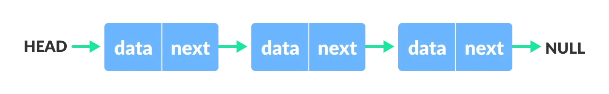
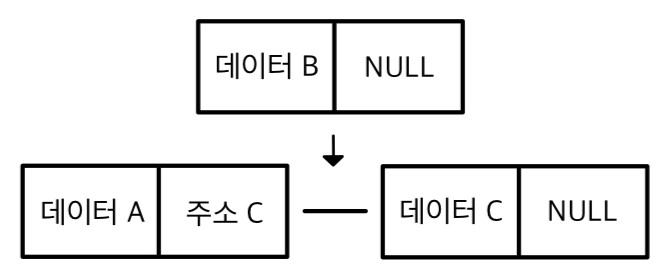
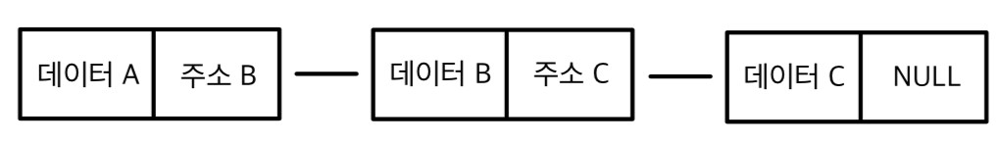
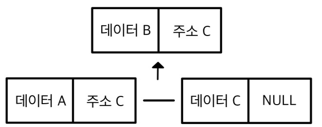

# 📑 Array vs ArrayList vs LinkedList

## 🏷️ Array

> 배열은 동일한 데이터 타입의 원소들을 연속된 메모리 공간에 저장하는 선형 자료구조

#### 장점 
- 순서 : 배열은 메모리에 연속적으로 저장되기 때문에 순서가 유지된다.
- 인덱스 : 순서가 존재하기 때문에, 인덱스를 통한 접근이 가능하다. 시간복잡도는 O(1)이다.
- 메모리 : 배열은 요소들을 연속된 메모리 공간에 저장하기 때문에 메모리 관리가 용이하다.

#### 단점
- 고정된 크기 : 선언할 때 크기를 정할 수 있고, 선언 후에는 변경이 불가능하다.
- 삽입/삭제 : 작업 시 다른 요소들을 모두 이동시켜야 하고, 최악의 경우 시간복잡도는 O(n)이다.

## 🏷️ ArrayList
> ArrayList는 크기가 가변적인 동적 배열을 구현한 자료구조

#### 장점
- 동적 크기 : 삽입/삭제 작업 시에 자동으로 크기를 조정한다.
- 인덱스 : 내부적으로 배열을 사용하여 저장하기 때문에 인덱스를 통한 접근이 가능하다. 시간복잡도는 O(1)이다.
- 메모리 : 크기를 동적으로 조정할 수 있기 때문에, 메모리를 효율적으로 사용할 수 있다.

#### 단점
- 삽입/삭제 : 작업 시 다른 요소들을 모두 이동시켜야 하고, 최악의 경우 시간복잡도는 O(n)이다.


#### Doubling 
크기를 동적으로 조정할 수 있도록, 배열의 크기를 늘리는 작업으로, 시간 복잡도는 O(n)이다.

```java
class ArrayList {
    private int size;
    private int index;
    private Object[] ary;

    public ArrayList() {
        this.size = 1;
        this.index = 0;
        this.ary = new Object[this.size];
    }

    public void add(Object obj) {
        if (isFull()) doubling();
        ary[this.index++] = obj;
    }

    private boolean isFull() {
        return this.index == this.size - 1;
    }

    // Doubling 작업
    private void doubling() {
        this.size = this.size * 2;
        Object[] douAry = new Object[this.size];
        for (int i = 0; i < this.ary.length; i++) douAry[i] = this.ary[i];
        this.ary = douAry;
    }

}
```

## 🏷️ Linked List
> 데이터 요소(Node)들이 링크(포인터)로 연결되어 선형 자료구조를 형성하는 자료구조

#### 장점
- 동적 크기 : 링크를 통해 연결되는 구조이므로 크기 변화가 유연하다.
- 삽입/삭제 : 링크에 대한 연산만으로 삽입/삭제 작업을 수행할 수 있다.
- 메모리 : 필요에 따라 메모리 공간을 유연하게 조절할 수 있기 때문에, 메모리 낭비를 줄일 수 있다.

#### 단점
- 무작위 접근 : 인덱스를 통한 접근이 힘들기 때문에, 순차적으로 탐색해야 한다. 최악의 경우 시간 복잡도는 O(n)이다.
- 추가적인 메모리 : Node에 데이터뿐 만 아니라 포인터도 저장해야 하기 때문에 추가적인 메모리 공간이 필요하다.

#### Node
연결 리스트를 구성하는 요소를 노드라고 한다. 노드는 데이터（Data Field）와 다음 노드를 가리키는 주소(Link Field)로 구성된다. 



<br>

### Singly LinkedList 구현
단순 연결 리스트는 Node에 주소가 한 개 밖에 없는 연결리스 트을 말한다. 

#### 삽입  
이전 노드 A의 주소에 삽입할 노드 B 를 저장한다. 노드 B 의 주소에는 이전 노드 A 의 주소에 저장되어 있던 노드 C를 저장한다.

[1] 노드 B 삽입 전



<br>

[2] 노드 B 삽입 후



#### 삭제 
이전 노드 A의 다음 노드를 삭제할 노드 B의 다음 노드 C로 덮어씌워 삭제를 수행한다. 자바에서는 삭제된 노드는 더 이상 사용되지 않는 불필요한 객체로 간주되며, 이러한 객체는 가비지 컬렉션에 의해 자동으로 처리되기 때문에 굳이 주소를 NULL 처리할 필요가 없다.

[1] 노드 B 삭제 전


<br>

[2] 노드 B 삭제 후



<br>

```java
class SinglyLinkedList{

    Node header;

    static class Node{
        int data;
        Node link;
    }

    SinglyLinkedList(){
        this.header = new Node();
    }

    void add(int data){
        Node end = new Node();
        end.data = data;
        Node next = this.header;
        while (next.link != null){
            next = next.link;
        }
        next.link = end;
    }

    void remove(int data){
        Node next = this.header;
        while (next.link != null){
            if (next.link.data == data)
                next.link = next.link.link;
            else
                next = next.link;
        }
    }
}
```

## 🏷️ Array vs ArrayList vs LinkedList

|          | Array              | ArrayList                 | LinkedList              |
|----------|-------------------|---------------------------|-------------------------|
| 구조     | 정적 크기의 배열  | 동적 크기의 배열             | 노드들이 링크로 연결된 선형 구조 |
| 크기 조정 | 변경 불가능        | 동적으로 크기 조정 가능      | 동적으로 크기 조정 가능                 |
| 데이터 타입 | 동일한 타입만 저장 | 동일한 타입만 저장           | 동일한 타입만 저장           |
| 접근 | O(1)              | O(1)                      | O(n)                    |
| 검색 | O(n)              | O(n)                      | O(n)                    |
| 삽입 / 삭제 | 최악: O(n), 최선: O(1) | 최악: O(n), 최선: O(1)    | 최악: O(n), 최선: O(1)  |

#### 시간 복잡도
1. 접근  
Array와 ArrayList은 인덱스를 통한 접근이 가능하기 때문에 O(1) 걸리지만, LinkedList는 불가능하기 때문에 순차적인 접근을 해야 하므로 O(n)이 걸린다.

2. 검색  
 index를 알지 못할 경우는 LinkedList와 마찬가지로 모두 순차적인 접근을 해야하므로 O(n)이 걸린다.

3. 삽입 / 삭제  
- Array와 ArrayList은 인덱스를 알 경우는 O(1)이 걸리지만, 아닐 경우는 순차적인 접근을 해야 하므로 O(n)이 걸린다. 이때, 빈 공간이 층분히 있을 경우를 전제로 한다.
- LinkedList는 첫 번째에서 삽입/삭제하는 경우는 O(1)이 걸리지만, 특정 위치에서는 순차적인 접근을 해야하므로 O(n)의 걸린다.

## Reference

- [자바로 배우는 자료구조 방식](https://product.kyobobook.co.kr/detail/S000001636199)
- [엔지니어 대한민국](https://www.youtube.com/@eleanorlim)