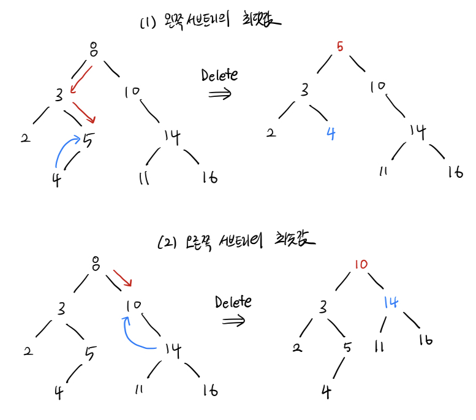

# 📑 Binary Search Tree

## 🏷️ 이진 검색 트리(Binary Search Tree)이란?
>  모든 노드가 최대 2개의 자식 노드를 가지면서, `왼쪽 자식 < 부모 < 오른쪽 자식` 관계를 가지는 자료구조


#### 특징
- 이진 검색트리는 중복값을 허용하지 않기 때문에, 동일한 값을 가진 노드가 2개 이상 존재하지 않는다.
- 왼쪽 < 노드 < 오른쪽 관계를 항상 준수한다. 모든 노드에서 왼쪽 서브트리의 모든 값은 해당 노드의 값보다 작고, 오른쪽 서브트리에 속한 노드들의 값은 해당 노드의 값보다 크다.
- 모든 노드에 대해 왼쪽 서브트리와 오른쪽 서브트리는 모두 이진 검색 트리이다.

## 🏷️ 이진 검색 트리(Binary Search Tree) 구현

### 연산
> 검색, 삽입, 삭제 연산 평균 시간 복잡도는 O(logN), 최악의 경우, O(n) 이다.

#### 검색
검색은 항상 Root Node에서 시작하고 Key 값을 찾을 때까지 단말노드로 내려간다.
- Key 값 == 현재 Node 값 : 탐색 종료
- Key 값 < 현재 Node 값 : 왼쪽 서브 트리에서 검색 연산 수행
- Key 값 > 현재 Node 값 : 오른쪽 서브 트리에서 검색 연산 수행

#### 삽입
1. 삽입 전 중복값이 존재하는지 단말 노드까지 검색 연산 수행
2. 성공 시, 삽입을 수행하지 않고 종료
3. 실패 시, 현재 단말노드 위치에서 비교연산을 통해 오른쪽/왼쪽 자식노드에 삽입

#### 삭제
삭제할 key값을 찾기 위해 검색 연산을 수행한다. 찾았을 경우, 삭제 방법은 자식노드의 수에 따라 달라진다. 

- 단말노드인 경우 (차수가 0 인 경우)  
    삭제할 노드의 부모노드 link field를 null로 설정한다. 
- 1 개의 자식 노드가 있는 경우 (차수가 1인경우)  
    삭제할 노드의 자식노드를 부모노드 위치로 올려준다.
- 2 개의 자식 노드가 있는 경우 (차수가 2인 경우)   
    1. 왼쪽 서브트리 최댓값 혹은 오른쪽 서브트리 최솟값을 가진 노드 A 를 찾아서 삭제할 노드 B 위치로 올려준다. 
    2. 노드 A가 단말 노드 이면, 작업을 종료한다.
    3. 노드 A가 자식이 있는 경우, 자식 노드를 노드 A가 있었던 자리로 다시 올려서 트리를 재구성한다.



<br>


```java
public class BinarySearchTree{

    private Node root;

    private static class Node{
        int data;
        Node left, right;
        Node(){}
        Node(int data){this.data = data;}
    }

    public boolean isEmpty(){return this.root == null;}

    public Node search(int data){
        if (isEmpty()) throw new IllegalStateException("Tree is Empty");
        return search(this.root, data);
    }

    private Node search(Node node, int data){
        if (node == null || node.data == data) return node;
        if (node.data > data) return search(node.left,data);
        return search(node.right,data);
    }

    public void insert(int data){this.root = insert(this.root, data);}

    private Node insert(Node node, int data) {
        if (node == null) return new Node(data);
        if (node.data > data) node.left = insert(node.left,data);
        if (node.data < data) node.right = insert(node.right,data);
        return node;
    }

    public void delete (int data){
        if (isEmpty()) throw new IllegalStateException("Tree is Empty");
        this.root = delete(this.root,data);
    }

    private Node delete(Node node, int data) {
        if (node == null) return node;
        if (node.data > data) node.left = delete(node.left,data);
        else if (node.data < data) node.right = delete(node.right,data);
        else{
            //경우 1. 자식이 없는 경우
            if (node.left == null && node.right == null) 
                return null;

            // 경우 2. 자식이 한개 있는 경우
            else if (node.left == null || node.right == null) 
                return node.left == null ? node.right : node.left;

            // 경우 3. 자식이 2개 있는 경우
            node.data = findMin(node.right); 
            node.right = delete(node.right,node.data); 

        }
        return node;
    }

    private int findMin(Node node){
        if (node.left == null) return node.data;
        return findMin(node.left);
    }

}
```

<br>

### 응용 분야

책보고 추가 하기

<br>

## Reference

- 자바로 배우는 자료구조 방식