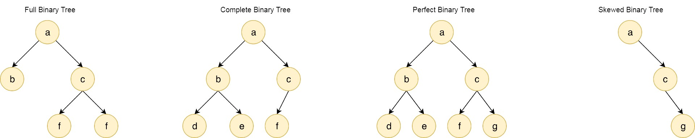

# 📑 Binary Tree

## 🏷️ 이진 트리(Binary Tree) 란?
> 각 노드가 최대 2개의 자식 노드를 가지는 자료구조

#### 특징
- 공백 노드 : 이진 트리에서는 노드가 없는 경우를 공백노드라고 한다.
- 간선 갯수 : 간선의 개수는 항상 ( 노드 개수 - 1 ) 개 이다.
- 노드 갯수 : 높이가 h인 이진트리가 공백노드를 제외하고 가질 수 있는 노드의 최소 갯수는 **h + 1** 개, 최대 갯수는 **2<sup><small>(h+1)</small></sup> - 1** 개 이다.

#### 종류



- Full Binary Tree (정 이진트리) : 정 이진트리는 모든 Node가 자식 노드를 0개 혹은 2개를 가지는 이진트리를 말한다.
- Complete Binary Tree (완전 이진트리) : 완전 이진트리는 마지막 레벨을 제외하고 모든 레벨이 채워져 있으며, 마지막 레벨은 왼쪽부터 차례대로 채워져 있는 이진 트리를 말한다.
- Perfect Binary Tree (포화 이진 트리)
    - 포화 이진트리는 모든 Node가 자식 노드를 2개를 가지고 있으며, 단말노드의 Level이 모두 일치하는 이진트리를 말한다. 
    - 노드 갯수 
        - n개의 단말노드를 가질 때, Node의 수는 **2n - 1** 개를 가진다.
        - 높이 h 를 가질 때, **2<sup><small>(h+1)</small></sup> - 1** 개를 가진다.
        - 높이 h 인 이진 트리 중에서 최대 갯수의 노드를 가진다.
- Skewed Binary Tree (편향 이진트리)
    - 편향 이진트리는 모든 노드가 하나의 자식만을 가지고 있는 이진트리이다.
    - 모든 노드들은 모두 같은 방향으로 자식노드를 가지고 있기때문에, 오른쪽 혹으 왼쪽으로 일직선 형태를 가진다.
    - 노드 갯수
        - 높이 h 를 가질 때, **h + 1** 개를 가진다.
        - 높이 h 인 이진 트리 중에서 최소 갯수의 노드를 가진다.


## 🏷️ 이진 트리(Binary Tree) 구현

```java
public class BinaryTree{

    private Node root;
    
    private static class Node{
        String data;
        Node left;
        Node right;

        Node(){}
        Node(String data){this.data = data;}
    }

    public Node makeTree(Node left, Node right, String data){
        Node result = new Node(data);
        result.left = left;
        result.right = right;
        return result;
    }

    public Node getRoot() {
        return root;
    }

    public void setRoot(Node root) {
        this.root = root;
    }

    public void preOrder(){
        preOrder(this.root);
    }

    private void preOrder(Node node){
        if (node == null) return;
        System.out.print(node.data + " -> ");
        preOrder(node.left);
        preOrder(node.right);
    }

}
```

<br>

### 응용 분야

책보고 추가 하기

<br>


## Reference

- [자바로 배우는 자료구조 방식](https://product.kyobobook.co.kr/detail/S000001636199)
- [엔지니어 대한민국](https://www.youtube.com/@eleanorlim)