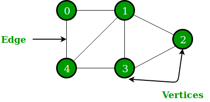
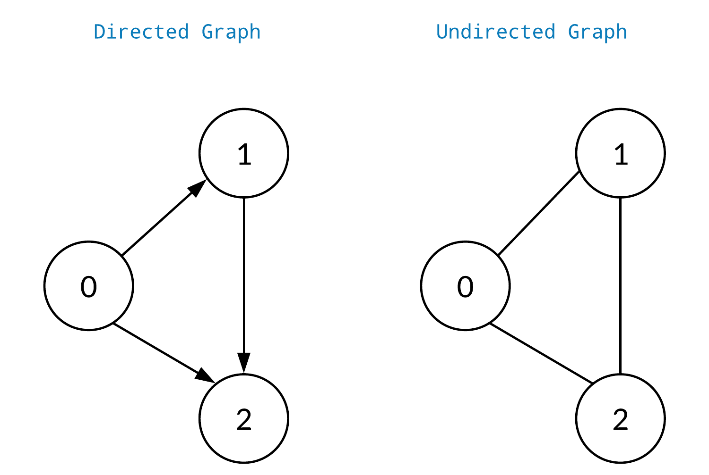
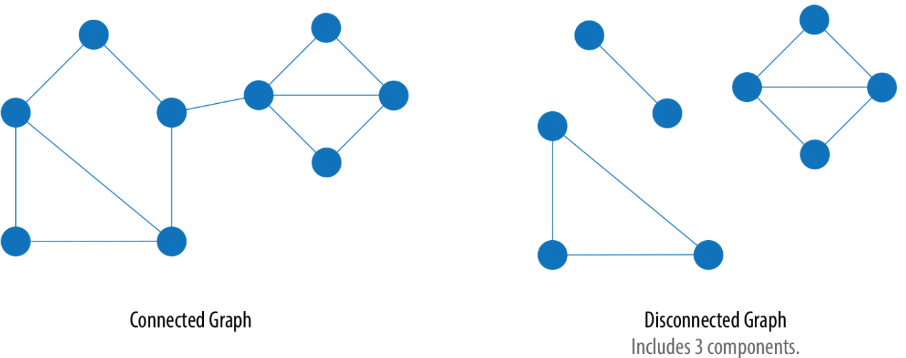

# 📑 Graph 

## 🏷️ 그래프(Graph) 란?
> 요소들간의 관계를 표현하는 망구조를 구현한 자료구조



#### 구조
그래프 G 는 연결할 객체를 나타내는 정점(vertex)의 집합 V와 연결하는 간선(edge)의 집합 E로 구성되며, G = ( V ,E )으로 표현 할 수 있다.
- Vertex(정점) : 그래프의 기본 요소
- Edge (간선) : 정점과 정점을 연결하는 선
- Degree (차수) : 정점이 가지는 간선의 수
    - 정점을 향하면 진입차수(in-degree)
    - 정점에서 나가면 진출차수(out-degree)
    - 방향 그래프에서 정점의 차수 = 진입차수 + 진출차수
- Path(경로) : 정점 a → b까지 간선을 따라 이동할때 만나는 정점을 순서대로 나열한 리스트
    - 단순 경로 : 시작 정점과 끝 정점을 제외하고 정점을 중복으로 거치지 않는 경로
- Cycle(사이클) : 시작 정점과 끝 정점이 동일하면서 중복으로 거치는 정점이 없는 단순 경로

#### 특징
- 응용 : 선형 자료구조나 트리가 표현할 수 없는 연결 구조들을 표현할 수 있기 때문에 다양한 분야에서 폭 넓게 사용할 수 있다. 대표적인 예로, 그래프는 네트워크를 나타내는 데 사용된다.
- 방향성 : 간선에 방향성이 있는가에 따라 방향성 혹은 무방향성 그래프로 나누어진다.
- 가중치 : 그래프에서 간선은 가중치를 가질 수 있다.

#### Graph vs Tree
Tree는 Graph 포함되는 형태로, 사이클이 없는 단순 연결 그래프 자료구조이다.

| 특징            | 그래프 (Graph)                             | 트리 (Tree)                             |
|---------------|-----------------------------------|-----------------------------------|
| 구조            | 정점(노드)과 간선으로 구성된 자료 구조           | 계층적 구조의 비선형 자료 구조            |
| 사이클 유무       | 사이클 가능                               | 사이클 없음                              |
| 루트 노드        | 루트 노드 없음                             | 단일 루트 노드                           |
| 연결성    | 모든 노드들이 연결되어 있을 수도 있고 없을 수도 있음 | 모든 노드들이 연결되어 있음                   |
| 방향성    | 노드 간에 방향성이 있을 수도 있고 없을 수도 있음      | 부모 → 자식 방향성을 가짐        |
| 하위 구조          | 여러 개의 연결 요소가 존재할 수 있음            | 오직 하나의 루트 노드와 0개 이상의 하위 노드들로 구성됨     |
| 순회    | 일반적인 그래프 순회 방법 (BFS, DFS 등) 사용 | in-order, pre-order, post-order 순회 방법 사용                  |

## 🏷️ 그래프(Graph) 종류

### Directed Graph ⟷ Undirected Graph  



#### Directed Graph
방향 그래프는 간선에 방향이 있는 그래프를 말한다.
- 방향 그래프에서 간선은 a → b를 <a,b>라고 한다. 
- <a,b>와 <b,a>는 서로 다른 간선으로 취급한다. 
- 방향 그래프 G의 정점의 집합 V를 V(G) = { a,b }, 간선의 집합을 E(G) = { <a,b>,<b,a> }로 표현할 수 있다.  

#### Undirected Graph
무방향 그래프는 간선에 방향이 없는 그래프를 말한다.
- 정점 a와 정점 b을 연결하는 간선을 (a,b)로 표현한다. 
- 방향이 없는 그래프이기에 (a,b)와 (b,a)는 같은 간선으로 취급한다. 
- 무방향 그래프 G의 정점의 집합 V를 V(G) = { a,b }, 간선의 집합을 E(G) =  { (a,b) }로 표현할 수 있다.

### Cyclic Graph ⟷ Acyclic Graph 


#### Cyclic Graph
사이클 그래프는 적어도 하나 이상의 사이클이 존재하는 그래프를 말한다.

#### Acyclic Graph
비사이클 그래프는 사이클이 존재하지 않는 그래프를 말한다.

### Complete Graph ⟷ Subgraph Graph

#### Complete Graph 
완전 그래프는 모든 정점들이 서로 연결되어 최대 간선 수를 가지는 그래프를 말한다.
- 무방향 그래프 : 정점이 n개이면, 최대 간선 수는 n x (n - 1) / 2 개
- 방향 그래프 : 정점이 n개이면, 최대 간선 수는 n x (n - 1) 개

#### Subgraph Graph
부분 그래프는 임의의 그래프에서 일부 정점과 간선으로 이루어진 그래프를 말한다.

### Connected Graph ⟷ Disconnected Graph



#### Connected Graph 
연결 그래프는 모든 정점들이 적어도 하나 이상의 경로를 가지는 그래프를 말한다.

#### Disconnected Graph
비연결 그래프는 최소 하나 이상의 정점이 다른 정점과의 경로를 가지지 않는 그래프를 말한다.

### Weight graph
가중치 그래프는 간선에 가중치를 할당하는 그래프로 네트워크라고도 말한다.  

## 🏷️ 그래프(Graph) 구현

### Adjacent Matrix
> 그래프를 2차원 배열로 구현하는 방법
N개의 정점을 가진 그래프를 구성하는 간선의 유무를 N x N 정방행렬으로 표현한다. 이렇게 그래프를 표현한 행렬을 **인접 행렬(Adjacent Matrix)**이라고 한다.
- 자기자신을 향하는 간선(self-loop)은 없을 경우, 대각선을 항상 0 값을 가진다.
- 무방향 그래프 : 
    - 대각선을 중심으로 양쪽은 값이 항상 같기 때문에 대칭을 이룬다.   
    - 정점 index 차수 = 행 index 합 = 열 index 합
- 방향그래프 : 
    - 서로 다른 간선으로 취급하기 때문에, 대칭을 이루지 않는다. 
    - 정점 index 진출차수 = 행 index 합
    - 정점 index 진입차수 = 열 index 합
- 간선의 개수에 상관없이 항상 N x N 개의 메모리를 사용하기 때문에 메모리 낭비 문제가 발생한다.

<details>
<summary>Adjacent Matrix Code</summary>

```java
public class AdjacentMatrix{
    private int matrix[][] = new int[10][10];
    private int totalV = 0;

    public void insertVertex(){
        if (totalV < 10){
            totalV++;
        }
    }

    public void insertEdge(int val01, int val02){
        if (val01 < totalV && val02 < totalV){
            matrix[val01][val02] = 1;
        }
    }

    public void printMatrix(){
        for (int i = 0; i < totalV; i++){
            for (int j = 0; j<totalV; j++){
                System.out.printf("%2d", matrix[i][j]);
            }
            System.out.println();
        }
    }
}
```
</details>    
<br>

### Adjacent List
>  정점에 대한 인접 정점들을 Linked List로 구현하는 방법
N개의 정점을 가진 그래프를 정점 N 크기의 배열과 배열 요소에 해당 정점과 인접한 정점들을 리스트로 저장하여 표현한다. 이렇게 그래프를 표현한 리스트을 **인접 리스트(Adjacent List)**이라고 한다.  
- 무방향 그래프 
    - 간선이 두 번 저장된다.
    -  N개의 정점과 E개의 간선을 가진 인접 리스트는 N개의 배열과 2E개의 노드가 필요하다.  
- 방향그래프 : 정점의 진출차수가 인접한 정점들이다.

<details>
<summary>Adjacent List Code</summary>

```java
public class Graph{

    private Node [] nodes; // node들을 저장할 배열

    private static class Node {
        int data;
        boolean marked; // 방문 여부
        LinkedList<Node> adjacent; // 인접한 node
        Node(int data) {
            this.data = data;
            this.marked = false;
            adjacent = new LinkedList<>();
        }
    }

    public Graph(int size){
        this.nodes = new Node[size];
        for (int i = 0; i < size; i++) nodes[i] = new Node(i);
    }

    public void addEdge(int i1, int i2){
        Node n1 = this.nodes[i1];
        Node n2 = this.nodes[i2];
        if (!n1.adjacent.contains(n2)) n1.adjacent.add(n2);
        if (!n2.adjacent.contains(n1)) n2.adjacent.add(n1);
    }

}
```
</details>    
<br>

## 🏷️ 그래프(Graph) 탐색

#### [Depth First Search](/Algorithm/Graph_Search.md#depth-first-search)
깊이 우선 탐색(DFS)은 시작 정점부터 시작하여 깊은 부분을 우선적으로 탐색하는 알고리즘
- Stack 혹은 재귀호출를 이용하여 구현한다.  
- Tree의 경우, 루트 노드 부터 시작사여 단말노드까지 우선적으로 탐색한다.
- Tree 검색 방법이었던 inorder, preorder, postorder들도 DFS에 속한다.

#### [Breadth First Search](/Algorithm/Graph_Search.md#breadth-first-search)
너비 운선 탐색(BFS)은 시작 정점부터 시작하여 인접한 정점들을 우선적으로 탐색하는 알고리즘
- Queue을 이용하여 구현한다.
- Tree의 경우, level단위로 형제노드들을 차례로 우선적으로 탐색한다.


### 응용 분야


## Reference

- [자바로 배우는 자료구조 방식](https://product.kyobobook.co.kr/detail/S000001636199)
- [엔지니어 대한민국](https://www.youtube.com/@eleanorlim)
- [사이트 링크](https://www.geeksforgeeks.org/difference-between-graph-and-tree/)