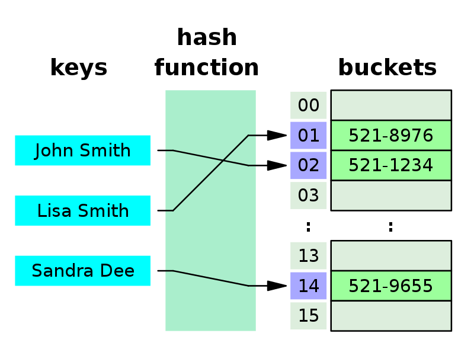
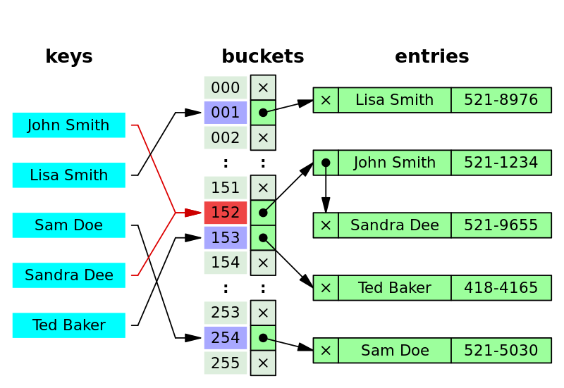

# 📑 Hash
> 임의 값을 고정길이로 변환하는 행위

## 🏷️ 해시 함수(hash function) 란?
> 키 값을 데이터 주소로 변환하는 함수

데이터를 효율적으로 관리하기 위해 키 값(Key)을 해시 값(hash value)으로 매핑(hashing)하는 함수이다.  
키 값을 비교하여 찾는 검색이 아니라, 산술적인 연산을 이용하여 해시 값으로 계산하여 데이터 주소로 찾아가는 계산 검색이다.

## 🏷️ 해시 테이블(Hash Table) 이란?
> 해시 함수를 사용하여 Key를 해시 값으로 매핑하고, 매핑된 값을 색인(index) 혹은 주소로 삼아 데이터 값과 함께 <Key, Value>형식으로 저장하는 자료구조

#### 접근 구조

- Bucket : 해시 테이블 내의 저장 공간
- Slot : 버킷 내부의 개별적인 저장 공간

#### 특징
- 검색 속도가 매우 빠르다. 해시 함수를 통해 매핑된 해시 값은 정수이기 때문에, 배열의 인덱스로 사용하여 데이터를 배열에 저장할 수 있다.  
따라서, O(1)의 시간 복잡도가 가능하다.
- 데이터를 해시 테이블에 저장할 때, 충돌(collison)현상을 막기위해 규칙을 잘 해야한다. 이를 Hash Algorithm이라고 한다.
- 충돌 발생 가능성이 있어도, 적은 리소스로 많은 데이터를 효울적으로 관리가 가능하기때문에 사용한다.

### Hash collision 
해시 충돌은 두 개의 키 값으로 동일한 해시 값으로 매핑되는 상황을 말한다.  
한 곳에 모든 데이터가 몰리는 경우, 한 곳만 비교해도 모두 비교하는 거와 마찬가지이므로 시간복잡도는 O(1)이 아니라 O(N)의 시간이 걸린다. 이를 해결하기 위해 Hash Algorithm을 이용해서 충돌을 최소화 해야 한다.

#### Chaining
체이닝은 해시 테이블의 각 버킷에 연결 리스트를 이용하여 충돌 데이터를 연결하는 방식이다.  
삽입, 삭제 연산이 용이하지만, 메모리 문제를 야기한다.

#### Open Addressing(개방 주소법)
개방 주소법은 충돌이 발생했을 때 빈 버킷을 찾아서 충돌 데이터를 저장하는 방식이다. 메모리 문제는 야기하지 않지만, 해시 충돌이 생길 수 있다.

- Linear Probing(선형 탐색) : 빈 버킷을 순차적으로 탐색한다.
- Quadratic probing(제곱 탐색) : 빈 버킷을 탐색 폭이 제곱 수로 늘리면서 탐색한다.
- Double Hashing(이중 해싱) : 2개의 해시 함수를 이용한다. 1번째 해시함수는 해시값을 매핑하기 위해 사용하고, 2번째 해시 함수는 해시충돌 발생 시 탐색 이동 폭을 얻기 위해 사용한다.

## 🏷️ 해시 맵(Hash Map) vs 해시 테이블(Hash Table) vs 해시셋(HashSet) 

|특징|해시맵(Hash Map)   | 해시 테이블(Hash table)  | 해시셋(Hash Set)                     
--|-----------------------------------|-----------------------------------|-----------------------------------
인터페이스 | 맵(Map) 인터페이스를 구현          | 맵(Map) 인터페이스를 구현            | Set 인터페이스를 구현               
데이터 저장 방식 | 키-값 쌍으로 데이터를 저장         | 키-값 쌍으로 데이터를 저장         | 객체로 데이터를 저장                
중복 데이터 | 중복 키 X, 중복 값 O | 중복 키 X, 중복 값 O | 중복 값 X             
null 허용 | null 허용 ( key의 경우, 중복 null X ) | null 허용하지 않음     | null 허용, 중복 null X
동기화 여부 | 동기화 X | 동기화 O | 동기화 X  
속도 | 일반적으로 셋 중에 가장 빠름 | HashMap보다 빠르지 않음             | HashMap보다 빠르지 않음              
삽입 | put()    | put()    | add() 

 

### 응용 분야

 

## Reference

- [자바로 배우는 자료구조 방식](https://product.kyobobook.co.kr/detail/S000001636199)
- [ratsgo님의 블로그](https://ratsgo.github.io/data%20structure&algorithm/2017/10/25/hash/)
- [사이트 링크](https://www.golinuxcloud.com/hashmap-vs-hashtable-vs-hashset-in-java/)