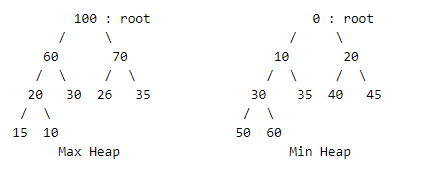

# 📑 Heap

## 🏷️ 힙(Heap)이란?
> 완전 이진 트리 기반의 자료구조로, 최대 또는 최솟값을 빠르게 검색하기 위한 자료구조



#### 특징
- 완전 이진 트리 : Heap은 완전 이진 트리를 기반의 자료구조이다. 때문에, 배열을 사용하여 효울적으로 구현할 수 있다.
- 시간복잡도 : 삽입 삭제 연산의 시간복잡도는 O(log n)이다. 
- 노드간의 관계 : Heap은 부모 > 자식 이거나, 부모 < 자식 구조 를 무조건 준수하기때문에 우선순위 관계를 표현하기 쉽다.
- 우선순위 큐 : 힙은 우선순위 큐를 구현하기 위해 사용되는 자료구조 중에 가장 효율적인 자료구조이다. 
- 종류 : 
    - Max Heap : 항상 부모 노드 > 자식 노드 관계를 가지는 Heap
    - Min Heap : 항상 부모 노드 < 자식 노드 관계를 가지는 Heap

#### 기본연산
Java에서의 "Heap"자료구조는 Heap 기반의 "PriorityQueue" 클래스를 의미한다.  
- Add / Offer : 우선순위에 따라 데이터가 삽입되어 정렬 상태를 유지
- Remove / Poll : 우선순위가 높은 데이터를 삭제
- Peek : 우선순위가 높은 데이터를 반환

#### Priority Queue
일반적인 큐는 삽입 순서에 따른 FIFO 구조이지만, 우선순위 큐는 우선순위에 따라 처리되는 자료구조이다.  
Priority Queue는 우선순위에 따라 데이터가 처리되는 자료구조로서, Heap을 이용하여 구현하였다.

## 🏷️ 힙(Heap) 구현

```java
public class Heap{
    private int size;
    private int heap[];

    public Heap(int capacity){
        this.size = 0;
        this.heap = new int[capacity + 1];
    }

    public void offer(int data){
        if (size > heap.length) throw new IllegalStateException("Heap is Full");
        heap[++size] = data;
        // 상향식
        int child = size;
        while(child > 1 && heap[child] > heap[child / 2]){
            swap(child, child/2);
            child/=2;
        }
    }

    public int poll(){
        if (size == 0) throw new IllegalStateException("Heap is Empty");
        int max = heap[1];
        heap[1] = heap[size--];

        int parent = 1;
        while(parent * 2 <= size){
            int child = parent * 2;
            if(child < size && heap[child] < heap[child + 1])
                child ++;
            if(heap[parent] >= heap[child])
                break;
            swap(parent, child);
            parent = child;
        }
        return max;
    }

    public int peek(){
        if (size == 0) throw new IllegalStateException("Heap is Empty");
        return heap[1];
    }

    private void swap(int i, int j){
        int tmp = heap[i];
        heap[i] = heap[j];
        heap[j] = tmp;
    }
}
```

#### 삽입
// 원래 그림 묘사 추가
// 배열 그림 묘사 추가

#### 삭제

// 원래 그림 묘사 추가
// 배열 그림 묘사 추가


## 🏷️ 코테 유형
- 우선순위 정렬
- 최단 경로, 탐색 : Dijkstra's Algorithm


## Reference

- [자바로 배우는 자료구조 방식](https://product.kyobobook.co.kr/detail/S000001636199)
- [엔지니어 대한민국](https://www.youtube.com/@eleanorlim)