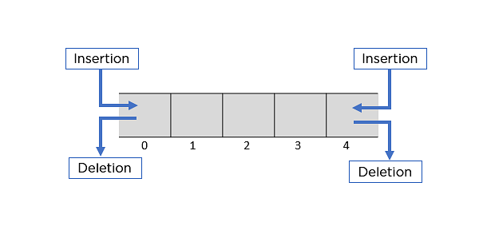

# 📑 Queue

## 🏷️ 큐(Queue) 란?
> 데이터를 순서대로 저장하고, 가장 먼저 저장된 데이터가 가장 먼저 삭제되는 자료구조이다.


#### 특징
- Rear, Front : Queue는 삽입연산은 Rear에서, 삭제 연산은 Front에만 가능하다.
- 선입선출(FIFO) : 시간 순서에 따라 자료가 저장되고, 가장 처음에 저장된 데이터가 가장 먼저 제거된다.

#### 기본 연산
- EnQueue : 큐의 마지막 위치(Rear) 데이터를 삽입
- DeQueue : 큐의 처음 위치(Front) 데이터 제거
- Peek : 큐의 처음 데이터(Front) 반환
- IsEmpty : 비어있는지를 True, False로 반환
- Size : 저장된 데이터의 개수를 반환

## 🏷️ 큐(Queue) 구현

### 순차 자료구조
큐를 1차월 배열을 통해 구현되는 방식은 데이터가 순차적으로 쌓이는 순서를 배열의 인덱스로 표현한다. rear 변수에는 마지막 데이터의 인덱스를 저장하여 데이터 삽입이 마지막 위치에서 이루어지도록 구현하고, front 변수에는 첫 번째 데이터의 인덱스를 저장하여 데이터 삭제가 처음 위치에서 이루어지도록 구현한다.  
- 초기 상태 : front = rear = -1
- 포화 상태 인식 문제 : rear에 저장된 인덱스가 마지막 인덱스인 경우, 여유공간이 있음에도 포화상태로 인식하는 문제가 생긴다. 이를 해소하기 위해, 데이터 이동 작업으로 위치 조정이 가능하지만, 큐의 효율성을 떨어뜨린다.

<br>

          rear = 2                rear = 3            rear = 3 
            ↓         삽입          ↓      삭제          ↓
    [ 3, 7, 2, 0, 0 ] ⇢ [ 3, 7, 2, 9, 0 ] ⇢ [ 3, 7, 2, 9, 0 ] 
    ↑                    ↑                     ↑
    front = -1           front = -1          front = 0    

```java
public class Queue{
    private int front;
    private int rear;
    private int [] queue;

    public Queue(int len){
        this.front = -1;
        this.rear = -1;
        this.queue = new int[len];
    }

    public int size(){
        return rear - front;
    }

    public boolean isEmpty(){
        return front == rear;
    }

    public boolean isFull(){
        return rear == queue.length - 1;
    }

    public void enQueue(int data){
        if (isFull()) throw new IllegalStateException("Queue is Full");
        queue[++rear] = data;
    }

    public int deQueue(){
        if(isEmpty()) throw new IllegalStateException("Queue is Empty");
        return queue[++front];
    }

    public int peek(){
        if(isEmpty()) throw new IllegalStateException("Queue is Empty");
        return queue[front + 1];
    }

}
```

### Circular Queue  
원형 큐란, 처음과 끝이 연결된 순환 형태의 자료구조 이다.

#### 특징
- 포화 상태 구분 : 공백 상태와 포화 상태를 구분하기 위해 자리 하나를 항상 비워둔다.
- 선형 큐 문제 개선 : 선형 큐는 처음과 끝이 연결되어 있지 않아서 데이터 이동 작업이 필요하지만, 원 형 큐는 연결되어 있기 때문에 이러한 작업이 필요 없다. 
- 삽입 / 삭제 연산 시 인덱스 계산 :  다음 인덱스 값을 계산하기 위해서 `( index + 1 ) % length` 연산을 사용한다. 이는 큐의 인덱스를 순환하도록 계산하여, 처음과 끝이 연결되도록 동작하게 한다.

#### 삽입

여기에 그림 묘사 추가

#### 삭제

여기에 그림 묘사 추가


```java
public class Queue {
    private int front;
    private int rear;
    private int [] queue;

    public Queue(int len){
        this.front = 0;
        this.rear = 0;
        this.queue = new int[len];
    }

    private int getNextIdx(int idx){
        return (idx + 1) % queue.length;
    }

    public boolean isEmpty() {
        return (front == rear);
    }

    public boolean isFull(){ 
        return front == getNextIdx(rear);
    }

    public void enQueue(int data) {
        if (isFull()) throw new IllegalStateException("Queue is Full");
        rear = getNextIdx(rear);
        queue[rear] = data;
    }

    public int deQueue() { 
        if(isEmpty()) throw new IllegalStateException("Queue is Empty");
        front = getNextIdx(front);
        return queue[front];
    }

    public int peek() {
        if(isEmpty()) throw new IllegalStateException("Queue is Empty");
        return queue[getNextIdx(front)];
    }
}
```
<br>

### 연결 자료구조 
큐를 연결 리스트를 통해 구현되는 방식은 데이터가 순차적으로 쌓이는 순서를 Node가 참조되는 순서로 표현한다. 첫 번째 Node를 front라는 참조변수에 저장하고, 마지막 Node를 rear라는 참조변수에 저장하여 삽입과 삭제가 해당 위치에서만 이루어지도록 구현한다.

#### 삽입

여기에 그림 묘사 추가

#### 삭제

여기에 그림 묘사 추가

```java
public class Queue{

    private Node front; 
    private Node rear;  

    private static class Node{
        int data;
        Node link;
        Node(){}
        Node(int data){this.data = data;}
    }

    public Queue(){
        front = null;
        rear = null;
    }

    public boolean isEmpty(){return front == null;}

    public void enQueue(int data){
        Node node = new Node(data);
        if (isEmpty()) front = node;
        if (rear != null) rear.link = node;
        rear = node;
    }

    public int deQueue(){
        if(isEmpty()) throw new IllegalStateException("Queue is Empty");
        int data = front.data;
        front = front.link;
        if (isEmpty()) rear = null;
        return data;
    }

    public int peek(){
        if(isEmpty()) throw new IllegalStateException("Queue is Empty");
        return front.data;
    }

}
```

<br>

## 🏷️ Deque (Double-ended Queue) 
> Deque은 Stack과 Queue의 특징을 모두 가지고 있는 자료구조이다.

 

#### 특징
- 양쪽 끝에서 각각 삽입과 삭제가 모두 가능하다.
- Front/Rear를 Stack의 top으로 생각하여 push, pop연산 모두 각각 가능하다. 즉, 큐의 선입선출(FIFO) 특성, 스택의 후입선출(LIFO) 특성 모두 가지고 있다.

#### 기본 연산
- AddFirst / OfferFirst : Deque의 Front 위치에 데이터를 삽입
- AddLast  / OfferLast  : Deque의 Rear 위치에 데이터를 삽입
- RemoveFirst / PollFirst : Deque의 Front 위치에 데이터 삭제
- RemoveLast  / PollLast  : Deque의 Rear 위치에 데이터 삭제
- PeekFirst / GetFirst : Deque의 Front 위치에 데이터를 반환
- PeekLast  / GetLast  : Deque의 Rear 위치에 데이터를 반환
- IsEmpty : 비어있는지를 True, False로 반환
- Size : 저장된 데이터의 개수를 반환

### 구현

```java
public class Deque{
    private Node front;
    private Node rear;

    private static class Node{
        int data;
        Node right;
        Node left;
        Node(int data){data = data;}
    }

    public Deque(){
        this.front = null;
        this.rear = null;
    }

    public boolean isEmpty(){
        return (front == null);
    }

    public void addFirst(int data){
        Node node = new Node(data);
        if (isEmpty()){
            front = node;
            rear = node;
        }else{
            node.right = front;
            front.left = node;
            front = node;
        }
    }

    public void addLast(int data){
        Node node = new Node(data);
        if (isEmpty()){
            front = node;
            rear = node;
        }else{
            node.left = rear;
            rear.right = node;
            rear = node;
        }
    }

    public int pollFirst(){
        if(isEmpty()) throw new IllegalStateException("Deque is Empty");
        int data = front.data;
        if (front.right == null){
            front = null;
            rear = null;
        }else{
            front = front.right;
            front.left = null;
        }
        return data;
    }

    public int pollLast(){
        if(isEmpty()) throw new IllegalStateException("Deque is Empty");
        int data = rear.data;
        if (rear.left == null){
            front = null;
            rear = null;
        }else{
            rear = rear.left;
            rear.right = null;
        }
        return data;
    }

    public int peekFirst(){
        if(isEmpty()) throw new IllegalStateException("Deque is Empty");
        return front.data;
    }

    public int peekLast(){
        if(isEmpty()) throw new IllegalStateException("Deque is Empty");
        return rear.data;
    }

}
```

<br>

### 응용 분야

책보고 추가 하기

<br>

## Reference

- [자바로 배우는 자료구조 방식](https://product.kyobobook.co.kr/detail/S000001636199)
- [엔지니어 대한민국](https://www.youtube.com/@eleanorlim)