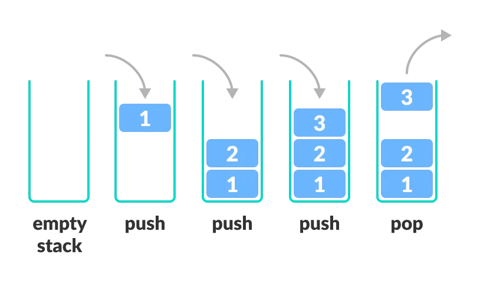
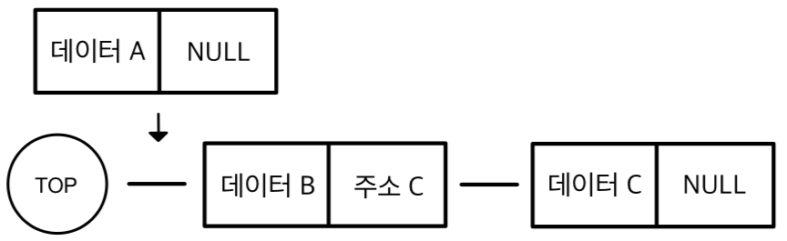
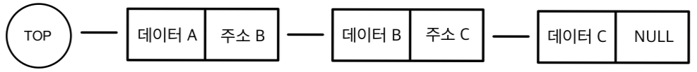
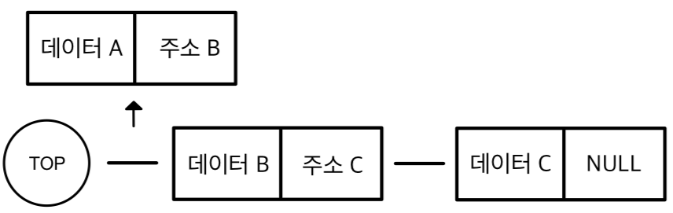

# 📑 Stack  

## 🏷️ 스택(Stack)이란?
> 데이터를 쌓아 올리는 형태의 선형 자료구조




#### 특징
- TOP : Stack은 top으로 정한 한 곳에서만 데이터를 쌓을 수 있고, 삽입 삭제가 가능하다.
- 후입선출(LIFO) : 시간 순서에 따라 자료가 쌓이고, 가장 최근에 삽입된 데이터가 가장 먼저 제거된다.

#### 기본 연산
- Push : 스택의 최상단(Top)에 데이터를 삽입
- Pop : 스택의 가장 최근 데이터 제거
- Peek : 스택의 최상단(Top) 데이터 반환
- IsEmpty : 비어있는지를 True, False로 반환
- Size : 저장된 데이터의 개수를 반환

## 🏷️스택(Stack) 구현

### 순차 자료구조
스택이 1차원 배열을 통해 구현되는 방식은 데이터가 순차적으로 쌓이는 순서를 배열의 인덱스로 표현한다. 마지막 데이터의 인덱스를 top이라는 변수에 저장하여 삽입 삭제가 마지막 데이터에서만 이루어지도록 구현한다.


                     삽입                 삭제 
    [ 3, 7, 2, 0, 0 ] ⇢ [ 3, 7, 2, 9, 0 ] ⇢ [ 3, 7, 2, 9, 0 ] 
            ↑                       ↑                ↑
           top = 2                 top = 3          top = 2


```java
public class Stack{
    private int top;
    private int [] stack;

    public Stack(int len){
        this.top = -1;
        this.stack = new int[len];
    }

    public int size(){
        return top + 1;
    }

    public boolean isEmpty(){
        return top == -1;
    }

    public boolean isFull(){
        return size() == stack.length;
    }

    public void push(int data){
        if (isFull()) throw new IllegalStateException("Stack is Full");
        stack[++top] = data;
    }

    public int pop(){
        if (isEmpty()) throw new IllegalStateException("Stack is Empty");
        return stack[top--];
    }

    public int peek(){
        if (isEmpty()) throw new IllegalStateException("Stack is Empty");
        return stack[top];
    }

}
```

### 연결 자료구조 
스택은 연결 리스트를 통해 구현되는 방식은 데이터가 순차적으로 쌓이는 순서를 Node가 참조되는 순서로 표현한다. 마지막 Node를 가리키는 참조변수를 top으로 사용하여, 삽입 삭제가 마지막 노드에서만 이루어지도록 구현한다.

#### 삽입

[1] Node A 삽입 전



<br>

[2] Node A 삽입 후



<br>


#### 삭제

[1] Node A 삭제 전


<br>

[1] Node A 삭제 후



<br>

```java
public class Stack{

    private Node top;

    private static class Node{
        int data;
        Node link;

        Node(){}
        Node(int data){this.data = data;}
    }

    public Stack(){
        top = new Node();
    }

    public boolean isEmpty(){return top.link == null;}

    public void push(int data){
        Node node = new Node(data);
        node.link = top.link;
        top.link = node;
    }

    public int pop(){
        if (isEmpty()) throw new EmptyStackException();
        int data = top.link.data;
        top.link = top.link.link;
        return data;
    }

    public int peek(){
        if (isEmpty()) throw new EmptyStackException();
        return top.link.data;
    }
    
}
```


### 응용 분야
스택은 후입선출(LIFO, Last In First Out) 구조를 가지고 있기 때문에 가장 최근에 삽입된 데이터가 가장 먼저 꺼내 필요가 있는 작업에서 주로 사용된다.
- 역순 문자열
- 시스템 스택 (프로그램 호출 및 복귀)
- 수식 괄호 검사
- 후위 표기법 변환 및 연산

<br>


## Reference

- [자바로 배우는 자료구조 방식](https://product.kyobobook.co.kr/detail/S000001636199)
- [엔지니어 대한민국](https://www.youtube.com/@eleanorlim)