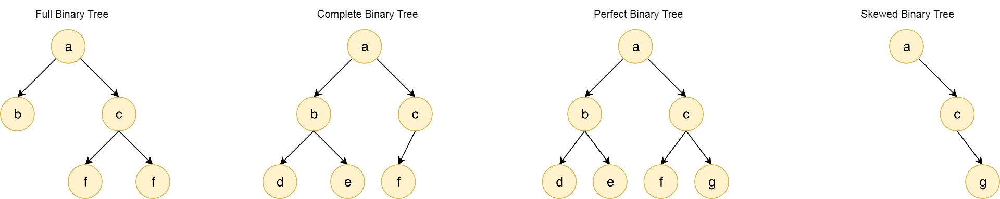
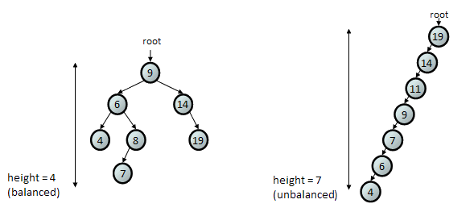
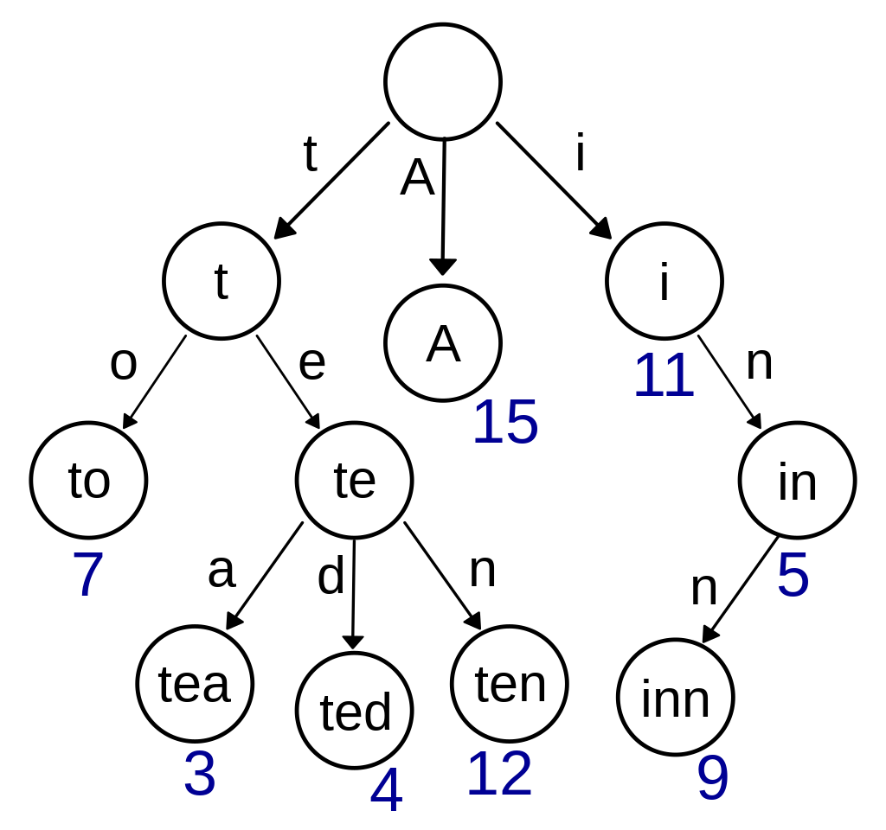

# 📑 Tree

## 🏷️ 트리(Tree)란?
> 비선형 자료구조로 자료들 간의 계층 관계를 가지는 계층형 자료구조

#### 구조
- Node
  - Root Node : 트리의 가장 상단에 위치한 노드
  - Parent Node (부모 노드) : 노드의 바로 위에 있는 노드를 부모노드라고 한다.
  - Child Node (자식 노드) : 노드의 바로 아래에 있는 노드를 자식노드라고 한다.
  - Sibling Node (형제 노드) : 같은 부모 노드를 가지고 있는 노드
  - Leaf Node (단말 노드) : 자식노드가 없고, 가장 끝에 위치한 노드
- Key : 노드에 저장된 값을 의미한다. 
- Edge (간선) : 노드를 연결하는 선
- Degree (차수) : 노드가 가지는 서브트리 혹은 자식 노드의 개수
- Level : 루트 노드부터 특정 노드까지의 경로에 존재하는 간선의 수 (루트 노드는 level 0이다.)
- Height : 루트 노드부터 가장 멀리 떨어진 단말 노드까지의 경로에 존재하는 간선의 수
- SubTree : 특정 노드와 해당 노드의 모든 자손들로 이루어진 트리구조, 각각의 노드들은 자식 노드 수만큼 서브트리를 가진다.
- Forest : 서로 연결되지 않은 여러 트리들의 집합

#### 특징
- 계층 구조 : 트리는 부모 - 자식 관계를 가진 계층 자료구조이다. 
- Graph : Tree는 사이클이 없는 단순 연결 그래프 자료구조이다.
- 경로 : 트리는 사이클이 없는 구조이기 때문에, 임의의 두 노드 간에 경로는 오직 하나의 경로만 존재한다.

### 트리 순회 (Tree Traversal)
트리 순회란 모든 노드를 한 번씩 모두 방문하는 방법을 말한다.

#### 전위 순회 (Pre-Order)

    현재 Node ⇒ 왼쪽 SubTree ⇒ 오른쪽 SubTree

#### 중위 순회 (In-Order)

    왼쪽 SubTree ⇒ 현재 Node ⇒ 오른쪽 SubTree

#### 후위 순회 (Post-Order)

    현재 Node ⇒ 오른쪽 SubTree ⇒ 왼쪽 SubTree

## 🏷️ 트리(Tree) 종류

### Binary Tree
이진트리는 모든 노드가 최대 2개의 자식 노드를 가지는 Tree 구조를 말한다.

#### 특징
- 공백 노드 : 이진트리에서는 노드가 없는 경우를 공백노드라고 한다.
- 간선 개수 : 간선의 개수는 항상 ( 노드 개수 - 1 ) 개 이다.
- 노드 개수 : 높이가 h인 이진트리가 공백노드를 제외하고 가질 수 있는 노드의 최소 개수는 **h + 1** 개, 최대 개수는 **2<small>(h+1)</small> - 1** 개 이다.

#### 종류

- Full Binary Tree (정 이진트리) : 정 이진트리는 모든 Node가 자식 노드를 0개 혹은 2개를 가지는 이진트리를 말한다.
- Complete Binary Tree (완전 이진트리) : 완전 이진트리는 마지막 레벨을 제외하고 모든 레벨이 채워져 있으며, 마지막 레벨은 왼쪽부터 차례대로 채워져 있는 이진트리를 말한다.
- Perfect Binary Tree (포화 이진트리)
    - 포화 이진트리는 모든 Node가 자식 노드를 2개를 가지고 있으며, 단말노드의 Level이 모두 일치하는 이진트리를 말한다. 
    - 노드 개수 
        - n개의 단말노드를 가질 때, Node의 수는 **2n - 1** 개를 가진다.
        - 높이 h를 가질 때, **2<small>(h+1)</small> - 1** 개를 가진다.
        - 높이 h 인 이진트리 중에서 최대 개수의 노드를 가진다.
- Skewed Binary Tree (편향 이진트리)
    - 편향 이진트리는 모든 노드가 하나의 자식만을 가지고 있는 이진트리이다.
    - 모든 노드들은 모두 같은 방향으로 자식노드를 가지고 있기 때문에, 오른쪽 혹은 왼쪽으로 일직선 형태를 가진다.
    - 노드 개수
        - 높이 h를 가질 때, **h + 1** 개를 가진다.
        - 높이 h 인 이진트리 중에서 최소 개수의 노드를 가진다.

### [Binary Search Tree](Binary_Search_Tree.md) 
이진 검색 트리는 모든 노드가 최대 2개의 자식 노드를 가지면서, `왼쪽 자식 < 부모 < 오른쪽 자식` 관계를 가지는 Tree 구조를 말한다.

### [Binary Heap](Heap.md)
이진 힙은 완전 이진트리 기반의, 최댓값 혹은 최솟값 탐색을 빠르게 하기 위해 구현된 자료구조이다.

### Balanced Tree ⬌ UnBalanced Tree

#### 균형 트리
균형 트리는 트리의 모든 노드들이 균형적으로 배치되어 있는 Tree 구조로, 모든 노드의 왼쪽 서브트리와 오른쪽 서브트리 높이 차이가 크지 않다.

Ex, Red - Black Tree, AVL Tree

#### 비균형 트리
비균형 트리는 트리의 모든 노드들이 한쪽으로 치우쳐져 있는 Tree 구조로, 모든 노드의 왼쪽 서브트리와 오른쪽 서브트리 높이 차이가 크다. 

### Trie
Trie는 문자열 탐색에 특화된 자료구조로, 각 Node에 Key - Value 형식으로 데이터를 저장하여 문자열을 효율적으로 탐색할 수 있는 자료구조이다.

Root는 공백으로 표시하고, 자식 노드는 Key - Value 형식 데이터를 저장한다. 루트 노드에서 시작하여 하위 노드를 따라 내려가면서 마지막 노드에 도달하면 검색하고자 했던 데이터가 해당 노드에 저장되어 있다.  
문자열 탐색 시에 Trie에 문자를 저장하고 탐색하게 되면, 문자열 길이가 L이라고 했을 때, O(L)의 시간 복잡도를 가진다.

 

## Reference

- [자바로 배우는 자료구조 방식](https://product.kyobobook.co.kr/detail/S000001636199)
- [엔지니어 대한민국](https://www.youtube.com/@eleanorlim)