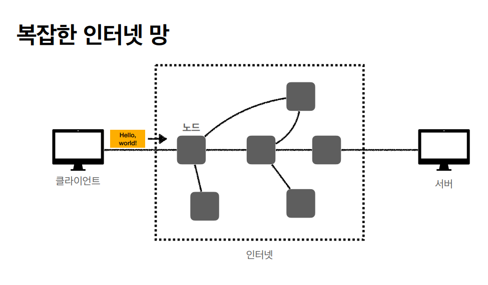
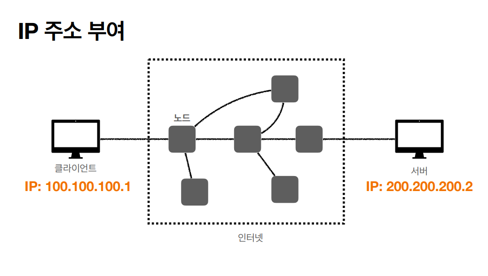
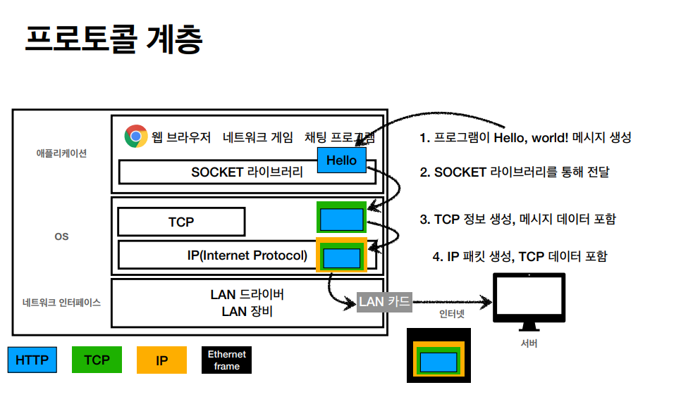

# 네트워크
==> 공부하면서 내가 이미지 새로 만듦

> HTTP에 대해 알아야하는 이유  

    : 모든것이 HTTP위에서 이루어지기 때문

## 인터넷 네트워크
### 1. 인터넷 통신

인터넷에서 컴퓨터는 어떻게 통신할까?

=> 클라이언트와 서버사이에 복잡하고 커대한 인터넷 망을 거쳐서
메세지가 안전하게 넘어가기 위해서 어떻게 통신할까?

(노드는 뭐지?)

### 2.IP(인터넷 프로토콜)
클라이언트의 IP와 서버의 IP가 존재함

#### IP(인터넷 프로토콜) 역활  

- 지정한 IP 주소(IP Address)에 데이터 전달
- 패킷(Packet)이라는 통신 단위로 데이터 전달  
(packet : package + 덩어리(버킷)의 합성어)

=> IP 패킷 정보 : 출발지 IP, 목적지 IP, 기타,,  
=> IP패킷이 [ 전송데이터 ]를 포장하고 있음

클라이언트가 IP 패킷을 전달해서 노드를 통과해서 서버로 가고
서버도 응답을 서버 패킷을 전달

#### IP 프로토콜의 한계
- 비연결성 : 패킷을 받을 대상이 없거나 서비스 불능상태여도 패킷 전송  
=> 클라이언트느 서버가 패킷을 받을 수있는 상황인지 알 수 없음  
=> 인터넷망의 노드중 한개가 끊길 경우  
- 비신뢰성 : 중간에 패킷이 사라질 경우  
패킷이 순서대로 안오는 경우  
=> 메세지 용량이 크면 몇개 끊어서 보낼 경우 서로 다른 노드를 타고 가면서 순서가 달라지는 경우가 발생
- 프로그램 구분 : 같은 IP를 사용하는 서버에서 통신하는 애플리케이션이 둘 이상이면?

#### TCP : IP 프로토콜의 한계를 해결
> 인터넷 프로토콜 스택의 4계층
- 애플리케이션 계층 : HTTP,FTP
- 전송 계층 : TCP, UDP
- 인터넷 계층 : IP
- 네트워크 인터페이스 계층

=> 메세지를 TCP로 감싸고 IP로 감싸서 IP패킷을 생성해서 전달?

TCP/IP 패킷 정보
IP 패킷:출발지 IP,목적지 IP, 기타,,----  
|     
| TCP 세그먼트 : 출발지 PORT, 목적지 PORT, 전송제어, 순서, 검증정보---    

|  |    전송데이터 이런식으로 감싸고 있음

|  |  
=> TCP과 관련된 정보가 들어있는 덕분에 IP의 문제점이 해결됨    
=> TCP/IP 패킷

TCP 대표적인 특징(전송 제어 프로토콜 Transmission Control Protocol)
- 연결지향 - TCP 3 way handshake(가상 연결) : 먼저 연결 유무를 보고 메세지 전달  
=> TCP 3 way handshake :  
    1. SYN(syncronize) : client 접속 요청(connect)
    2. SYN-ACK : client 요청수락과 sever 접속 요청
    3. ACK : sever 요청 수락 
    => 양쪽에서 요청과 수락을 주고 받고 난 뒤에 데이터를 전송함  
    => 물리적인 연결은 아니고 논리적인 연결
- 데이터 전달 보증 : 패킷이 누락되어있는지 확인 가능  
=> 데이테 전송 받고나서 잘 받았다고 응답을 보내줌 (request : ok????)
- 순서 보장  
=> 순서가 잘못 보내지면, 잘못 보낸 순서를 다시 보내도록 함 (TCP 세그먼트에 포함 된 정보가 있기 때문에 가능)
- 신뢰할 수 있는 프로토콜  
=> 현재는 대부분 TCP 사용

#### UDP : 사용자 데이터그램 프로토콜(User Datafram Protocol)
- 하얀 도화지에 비유(기능이 거의 없음)
- 연결지향 - TCP 3 way handshake X
- 데이터 전달 보증 X
- 순서보장 X
- 데이터 전달 및 순서가 보장되지 않지만, 단순하고 빠름  
- 정리   
    - IP와 거의 같다 + PORT + 체크섬 정도만 추가
    - 애플리케이션 에서 추가 작업 필요
    - 최적화 작업이 필요할 경우, TCP는 있지만, UDP는 없기 때문에 최적화 가능  
    => 그렇기 때문에 요즘 각광 받음 (UDP 프로토콜)

### PORT
> 한번에 둘 이상 연결해야 하면 IP만으로 어떻게 구분?

IP : 목적지 서버를 찾아줌
PORT : 같은 IP내에서 프로세스 구분
- 0 ~ 65535 : 할당 가능
- 0 ~1023 : 잘 알려진 port, 사용하지 않는 것이 좋음
    - FTP : 20,21
    - TELNET : 23
    - HTTP : 80
    - HTTPS : 443

### DNS (도메인 이름 시스템 :  Domain Name System)
- 전화번호부
- 도메인 명을 IP주소로 변환  
=> IP주소가 변환된 경우에도 도메인을 통해 해당 변경된 IP로 이동할 수 있음